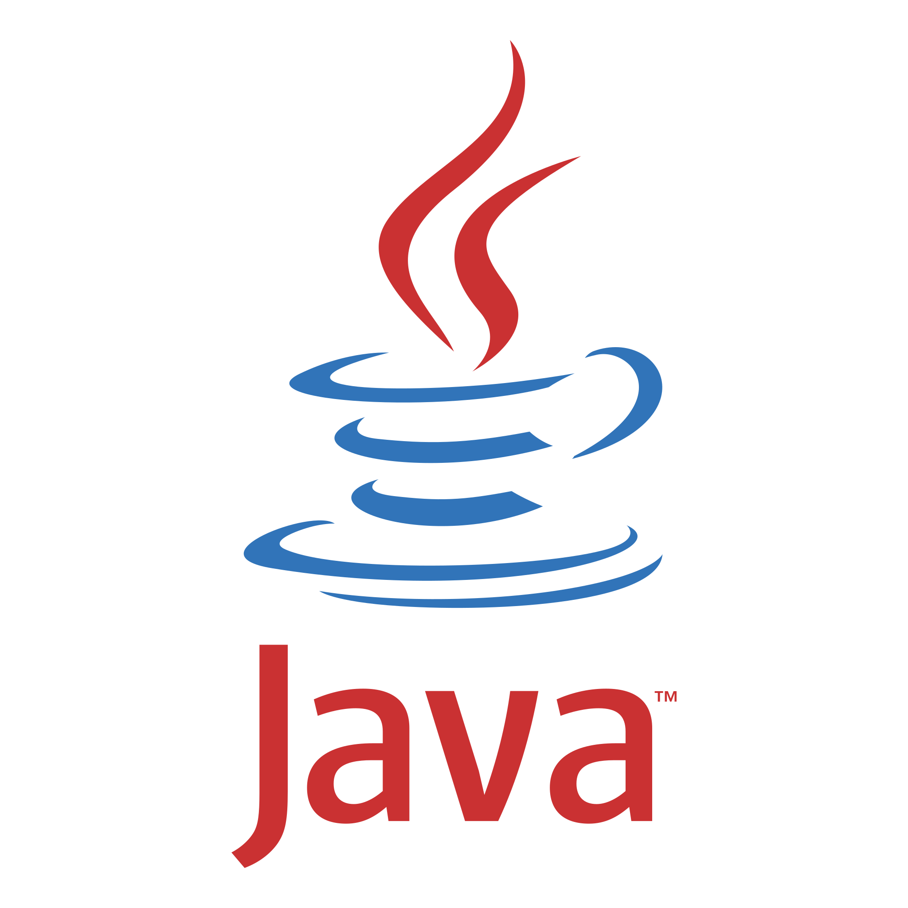

  

<h1 align="center">Hi, I'm Daniel Pizarro</h1>
<h4 font-size="20" align="center">🤖 UiPath RPA - Developer</h4>
<h4 font-size="20" align="center"> I try to be a back-end / Front-end developer</h4>

  

  
📚 I’m currently learning Computer Programming

  
🤠I’m looking to collaborate on UiPath Studio

  
🆘 I’m looking for help with Front Design

  
📫 Email me at Saavedra.Alejandro@outlook.com

<h2 align="center">My Social Media :mailbox_with_no_mail:</h2>

  
  
  
  

  <h2>Softwares 💻</h2>
  

    

      
      
      
    

  

  <h2>Languages ⌨️</h2>
  

    

      
      
      
    

  

<!--
**DanielPizarroDeveloper/DanielPizarroDeveloper** is a ✨ _special_ ✨ repository because its `README.md` (this file) appears on your GitHub profile.

Here are some ideas to get you started:

- 🔭 I’m currently working on ...
- 🌱 I’m currently learning ...
- 👯 I’m looking to collaborate on ...
- 🤔 I’m looking for help with ...
- 💬 Ask me about ...
- 📫 How to reach me: ...
- 😄 Pronouns: ...
- ⚡ Fun fact: ...
-->
